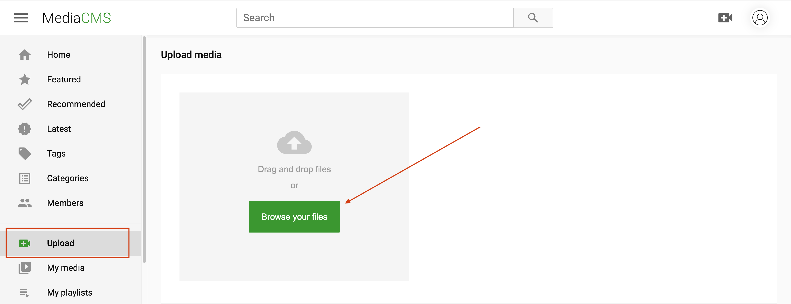
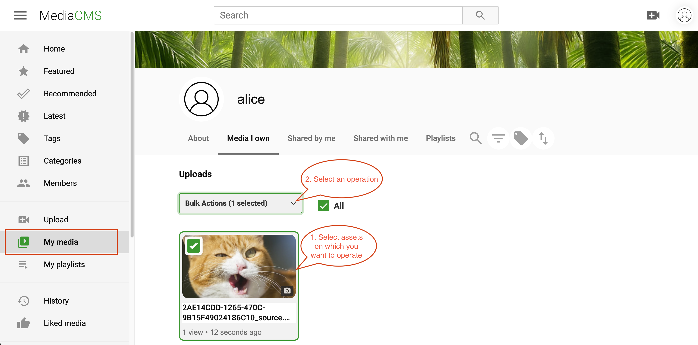
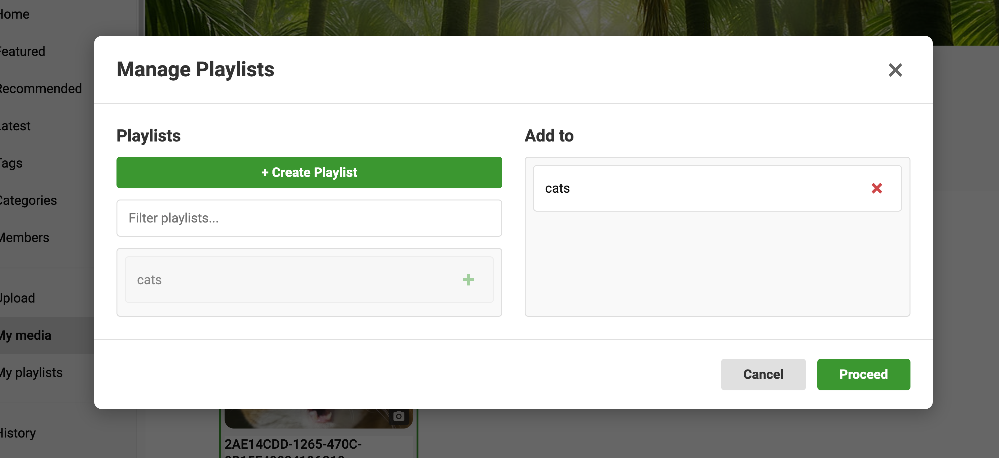
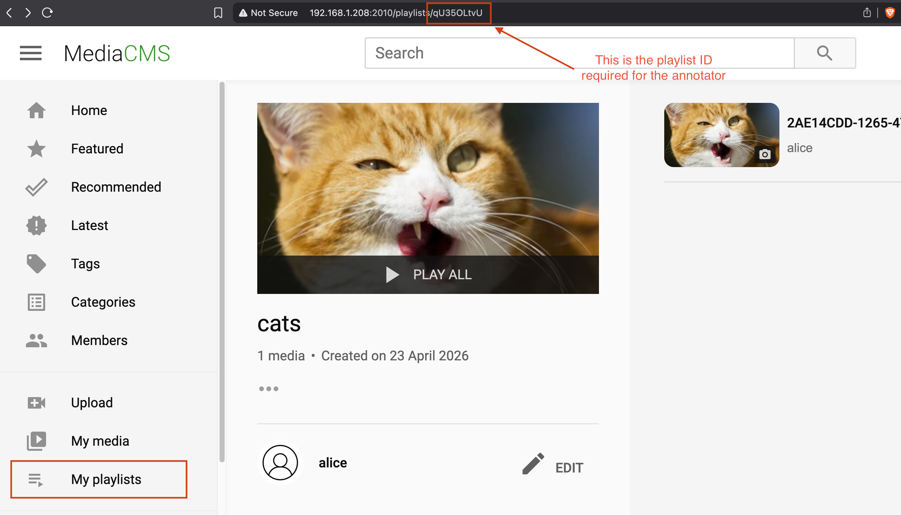

# Annotator User Documentation

## Overview

**Annotator** is a tool for media asset annotation and management, integrated with **MediaCMS**. 

Annotator works with either:

- a **playlist** of media assets, or
- a **single asset** delivered by MediaCMS.

> Repository and additional information: [media-asset-annotator on GitHub](https://github.com/ulcheyev/media-asset-annotator)

---

## MediaCMS: Basic Access

> ⚠️ **Required role:** must be assigned the `mediacms-access-role` to use MediaCMS.

Assets can be uploaded to MediaCMS through the **web interface**.

### Uploading an Asset

1. Log in to the MediaCMS web interface.
2. Upload the asset.



### Creating a Playlist

1. Go to **My media**.
2. Select the assets you want to include in the playlist.

   

3. Choose **Add to / Remove from playlist**, then create a new playlist or pick an existing one. Click **Proceed** to continue.

   

4. Go to **My playlists**. The playlist is now created with the selected assets. The **playlist ID** is visible in the URL — this is the ID required by the Annotator.

   

---

## Accessing the Annotator

> ⚠️ **Required role:** must be assigned the `annotator-access-role` to use the Annotator.

The Annotator is served under the `/annotator` path of the **Record Manager nginx gateway**.

Depending on what you want to open, use one of the two URLs below.

### Open a Playlist

Load all assets from a MediaCMS playlist:

```
http://<host>/annotator/list?id=<playlist_id_in_media_cms>
```

Replace `<playlist_id_in_media_cms>` with the playlist ID obtained in the previous section.

### Open a Single Asset

Load one specific asset directly:

```
http://<host>/annotator/asset?id=<asset_id_in_media_cms>
```

Replace `<asset_id_in_media_cms>` with the asset ID from MediaCMS.

