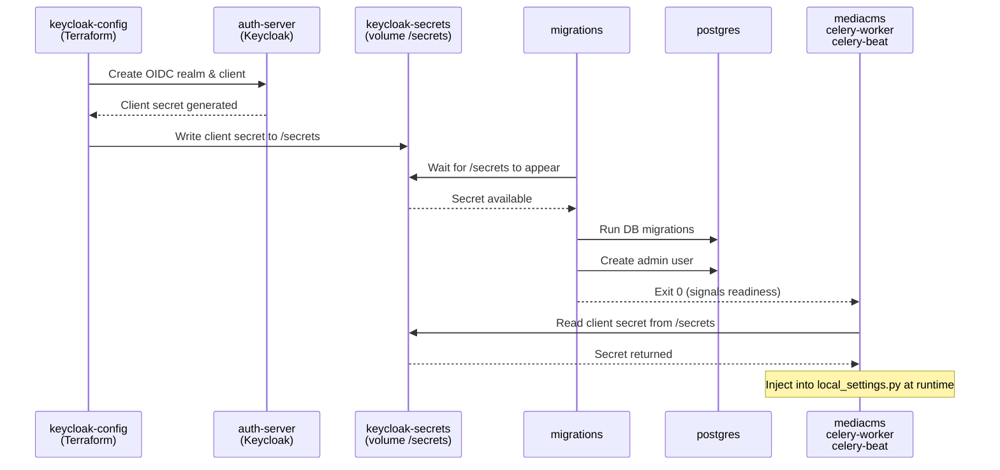
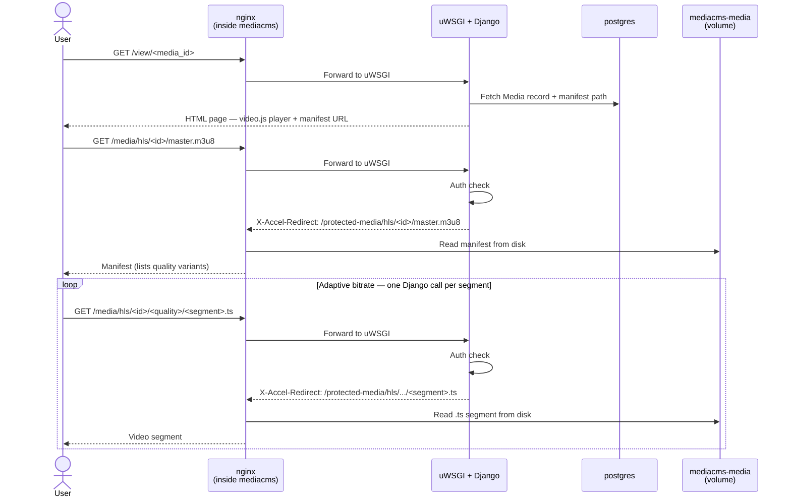

# Scaling MediaCMS

## Understanding the architecture of MediaCMS

MediaCMS is not a single service. It's a distributed system built around Django and Celery.

| Service / Container         | Role               | Responsibilities                                                           | Scalable             | Notes                                                        |
| --------------------------- | ------------------ | -------------------------------------------------------------------------- | -------------------- |--------------------------------------------------------------|
| **migrations**              | Init / setup job   | Runs DB migrations, initializes admin user, waits for secrets              | ❌ No                 | One-time job, must complete before app start                 |
| **celery-worker**           | Background worker  | Video transcoding, thumbnail generation, async processing                  | ✅ Yes | Becomes a bottleneck with a large number of uploading videos |
| **mediacms (web)**          | Web layer (Django) | Handles HTTP requests, UI, API, authentication (OIDC), metadata operations | ✅ Yes | Stateless, requires load balancing                           |
| **celery-beat**             | Scheduler          | Executes periodic tasks (cron jobs)                                        | ❌ No                 | Must run as a single instance                                |
| **redis**                   | Cache / broker     | Celery task queue, caching, session storage                                | ⚠️ Limited           | Requires clustering for scaling                              |
| **postgres**                | Database           | Stores users, media metadata, application state                            | ⚠️ Limited           | Use replication, not horizontal scaling                      |
| **mediacms-media (volume)** | File storage       | Stores uploaded media files                                                | ⚠️ Critical          | Must be shared (e.g. S3 recommended)                         |

Services related to MediaCMS (`mediacms`, `celery-worker`, `celery-beat`, `migrations`) are built from the same [Docker image](../configs/mediacms/Dockerfile).

```text
The mediacms image is built to use supervisord as the main process, which manages one or
more services required to run mediacms. We can toggle which services are run in a given
container by setting the environment variables below to `yes` or `no`:

  ENABLE_UWSGI
  ENABLE_NGINX
  ENABLE_CELERY_BEAT
  ENABLE_CELERY_SHORT
  ENABLE_CELERY_LONG
  ENABLE_MIGRATIONS

By default, all these services are enabled, but in order to create a scaleable deployment,
some of them can be disabled, splitting the service up into smaller services.
```

[MediaCMS Admin Docs](https://github.com/mediacms-io/mediacms/blob/b7427869b6c07700f99b7d3fbe963c455b1ad5e4/docs/admins_docs.md)

Because all four containers share the same image, they also share the same volume mounts. Every container in the MediaCMS group must mount both `mediacms-media` (for media files) and `keycloak-secrets` (for the OAuth client secret). 

### Bootstrapping handshake

Before MediaCMS can start, it must wait for a secret generated by `keycloak-config`. This handshake is why `keycloak-secrets` is mounted in `migrations`, `mediacms`, `celery-worker`, `celery-beat`, and `oauth2-proxy` — they all need to agree on the same client secret without it being hardcoded in the image or committed to the repository.



### Streaming Flow

uWSGI is the WSGI application server running inside the `mediacms` container — it translates incoming HTTP requests into Django application calls. Once a browser has received the player page, all subsequent segment requests are handled entirely by nginx reading directly from the `mediacms-media` volume, bypassing Django and uWSGI completely.



## Streaming Scaling

When many users watch videos concurrently, `celery-worker` is irrelevant — the bottleneck shifts entirely to **nginx and the volume read throughput**. Each viewer continuously pulls `.ts` segments; at high concurrency nginx opens many simultaneous file descriptors and the storage backend must sustain many parallel reads.

1. **Single host** — nginx and the volume live on the same machine. The ceiling is set by CPU (nginx worker processes), open file descriptor limits, and disk IOPS.
2. **Multiple nodes** — when a single host is no longer enough, the local Docker volume becomes the bottleneck: it cannot be read by nginx running on a different machine. Storage must be replaced with something all nodes can reach simultaneously — NFS, object storage, or a CDN. 

## Multi-node scaling options

For multiple nodes you can use **Object storage**.
 
### Object storage

You can use:
- **MinIO** — self-hosted, S3-compatible, runs as a Docker container
- **AWS S3 / GCP Cloud Storage** — managed, no infrastructure to maintain

### Step 1 — Deploy MinIO / Get S3

Refer to [MinIO docs](https://docs.min.io/enterprise/aistor-object-store/installation/container/install/).

### Step 2 — Configure MediaCMS to use object storage

In [local_settings.py](../configs/mediacms/local_settings.py) add:

```text
DEFAULT_FILE_STORAGE = "storages.backends.s3boto3.S3Boto3Storage"
AWS_ACCESS_KEY_ID = "minio"
AWS_SECRET_ACCESS_KEY = "minio123"
AWS_STORAGE_BUCKET_NAME = "mediacms"
AWS_S3_ENDPOINT_URL = "http://minio:9000"   # remove for AWS S3
AWS_S3_ADDRESSING_STYLE = "path"             # required for MinIO
```
Refer to [Django DOCS](https://django-storages.readthedocs.io/en/latest/backends/amazon-S3.html)
All uploads and reads — including HLS segments — now go through object storage. The `mediacms-media` local volume is no longer used for media files.

### Step 3 — Remove the local volume dependency

Once storage is in MinIO or S3, remove the `mediacms-media` volume mount from `mediacms`, `celery-worker`, and `celery-beat` in `docker-compose.yml`. 

### Step 4 — Scale mediacms instances

Deploy `mediacms` on multiple nodes.

Each node should run:
- one `mediacms` instance (nginx + Django)
- connected to the same:
    - object storage (S3 / MinIO)
    - Redis
    - Postgres
    - Keycloak

#### 🔐 Shared OIDC client secret (critical)

All nodes must use the **same OIDC client credentials** (client ID + client secret) for Keycloak.
How to share the client secret:
* Option 1 — Environment variables: provide the same secret to all nodes via environment variables by configuring [local_settings.py](../configs/mediacms/local_settings.py)
* Option 2 — Secret management system: use a centralized secret store. For example [HashiCorp Vault](https://www.hashicorp.com/en/products/vault)

### Step 5 — Add a load balancer for mediacms instances

The gateway nginx issues a `302` redirect to `MEDIA_CMS_PUBLIC_ORIGIN`. 
The load balancer must sit in front of the `mediacms` containers at the URL the browser lands on after the redirect.
It can be any reverse proxy or load balancer. nginx example:

```nginx
upstream mediacms_cluster {
    server mediacms_1:80;
    server mediacms_2:80;
    server mediacms_3:80; 
    ...
    keepalive 32;
}
 
server {
    listen 80;
 
    location / {
        proxy_pass         http://mediacms_cluster;
        proxy_http_version 1.1;
        proxy_set_header   Host      $host;
        proxy_set_header   X-Real-IP $remote_addr;
    }
}
```

### Step 6 — Update the gateway environment variable

Point in the stack gateway environment to the load balancer from Step 5:

```dotenv
MEDIA_CMS_PUBLIC_ORIGIN=http://<load-balancer-host>:<port>
```